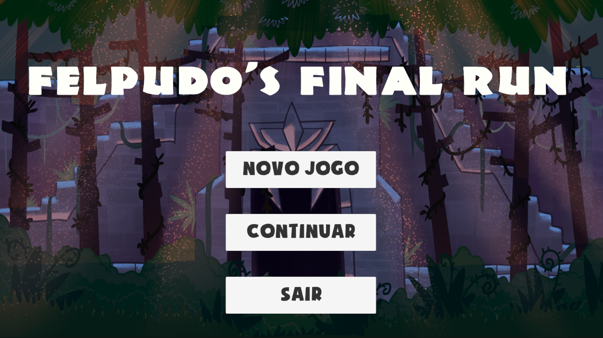
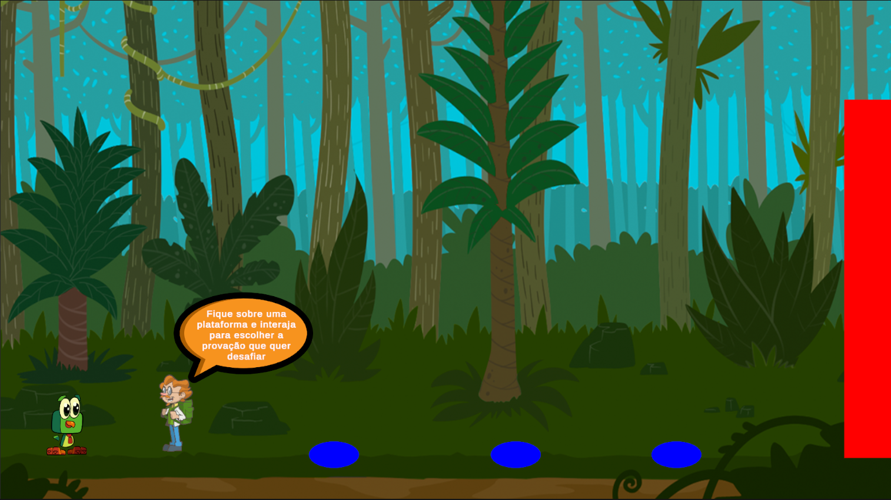
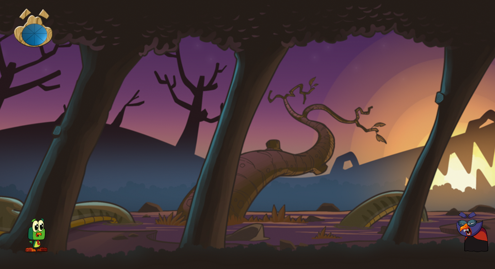

# FelpudosFinalRun

Esse é um jogo 2D desenvolvido na Unity Engine como avaliação para a disciplina de programação de jogos no curso de jogos digitais da Universidade do Estado da Bahia e tem por objetivo medir os conhecimentos obtidos na ferramenta Unity Engine.

 

# Gameplay

Jogue como Felpudo, um passáro destemido que deve passar pelas provações do tirano Uruca para salvar sua amada Fofura. Vença 3 minigames diferentes para destravar a passagem até Uruca e confronte de uma vez por todas esse ser maligno que persegue Felpudo e Fofura.

 
  

É possivel jogar o projeto de forma on-line com o PlayUnity no link a seguir:
 
